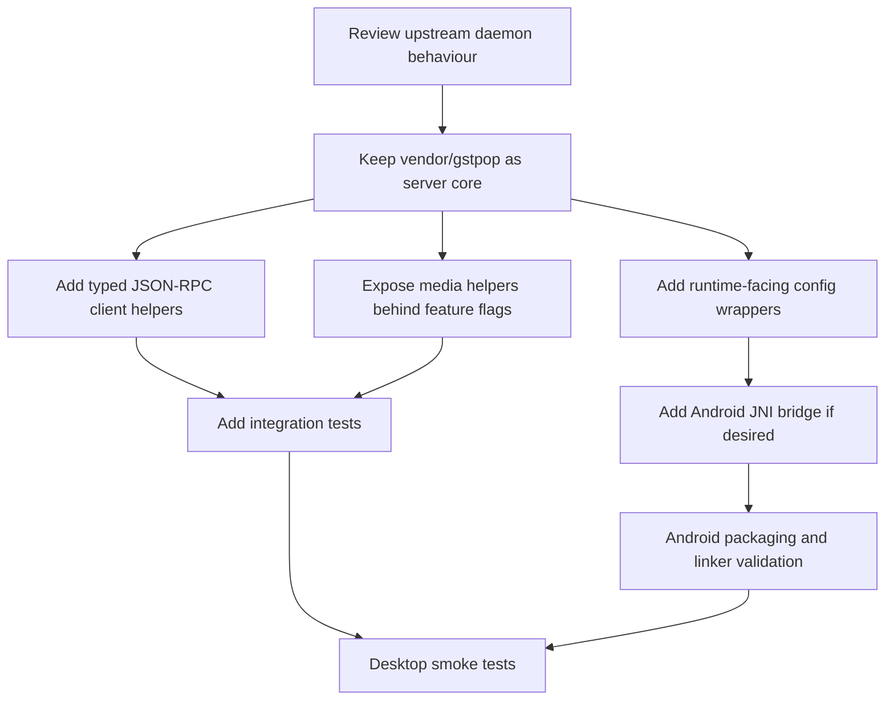
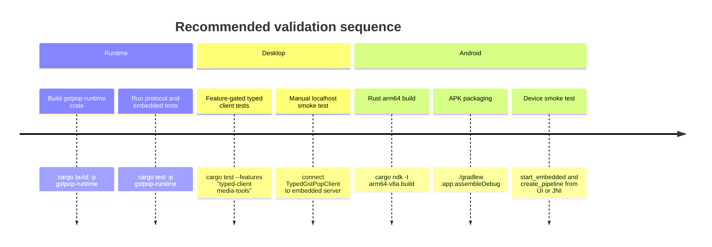
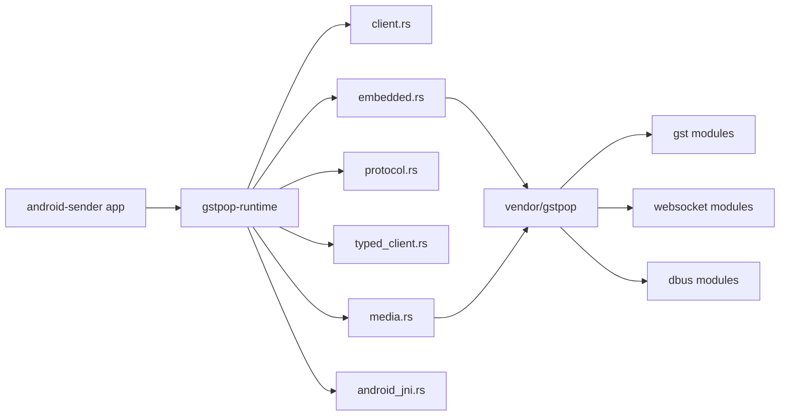

# Git tree comparison and migration plan for gstpop-runtime

## Executive summary

I reviewed the upstream source tree at `dabrain34/gstpop/daemon` on `main`, and compared it with the Android target tree in `kodyka/fcast-android-sender` branch `phase-10`, focusing on `crates/gstpop-runtime` and, where necessary, the vendored `vendor/gstpop` library that `gstpop-runtime` already depends on. The most important finding is that there are **two very different answers depending on what you mean by “target”**. If you compare only `crates/gstpop-runtime`, then most of the upstream daemon is absent. If you compare the **effective Android implementation** used by the app, then **most of the daemon’s library-side functionality has already been ported into `vendor/gstpop`**, while `crates/gstpop-runtime` currently provides only three things: an embedded host wrapper, a JSON-RPC/WebSocket client, and a light client-side protocol model. citeturn23view0turn17view0turn38view0turn38view1turn38view2turn28view2turn47view0

That means the migration work is not “port the daemon from scratch”. It is mostly: **expose and adapt what is already vendored**, preserve the Android-specific changes already present in `vendor/gstpop`, and add the missing runtime-facing surfaces that the Android app actually needs. The biggest concrete gaps are: typed client helpers for upstream JSON-RPC methods, a runtime-facing configuration surface for embedded startup, optional wrappers for media discovery / playbin creation / registry inspection, and any JNI bridge you want to keep inside `gstpop-runtime` rather than the app crate. The major things that are still genuinely missing are the CLI entry point, subcommands, signal handling, and associated command-line tests. citeturn48view0turn18view0turn46view0turn28view2turn28view0turn24view1

There are also some **important Android-specific compatibility points**. The target tree’s root `build.rs` hard-codes Android linker setup around `ANDROID_NDK_ROOT` or `ANDROID_NDK_HOME`, `GSTREAMER_ROOT_ANDROID`, ABI mapping, and a specific Clang builtins path for **NDK r25c**; it also assumes host tags of `darwin-x86_64`, `windows-x86_64`, or `linux-x86_64`, which is fragile on Apple Silicon and newer NDK layouts. Meanwhile `app/build.gradle` currently filters packaging to **`arm64-v8a` only**, even though the workspace metadata lists four Android Rust targets. Relative-path media handling from upstream is also a portability trap, because upstream `normalize_uri` resolves bare paths against `std::env::current_dir()`, whereas Android best practice is to use app-specific internal or external storage directories obtained from the Android context. citeturn39view0turn39view1turn39view2turn27view0turn43view4

A second important finding is that you should **preserve the target tree’s adaptations rather than blindly sync upstream**. For example, upstream `server.rs` lets `WebSocketServer` bind internally, whereas the vendored Android tree already **pre-binds the `TcpListener` before spawning**, so bind failures surface synchronously and predictably. That is a real improvement for embedded/mobile startup and should be retained. Also, the vendored tree has already upgraded the daemon library from upstream’s `gstreamer`/`gstreamer-pbutils` `0.23` to `0.25`, so any code copied from upstream must be reconciled against the vendored API level, not pasted verbatim. citeturn24view0turn30view1turn48view0turn18view0turn39view1

## Repository comparison and current port status

The upstream daemon’s documented source layout includes a CLI entry point, command modules, GStreamer management modules, WebSocket modules, and Linux-only DBus modules. The target `gstpop-runtime` crate, by contrast, contains only `client`, `embedded`, `protocol`, and tests; the rest of the daemon library surface lives under `vendor/gstpop`, whose `gst`, `websocket`, and `dbus` subtrees mirror the upstream module layout very closely. citeturn23view0turn28view2turn17view0turn38view0turn38view1turn38view2

The practical implication is that the correct status vocabulary is:

- **Already ported**: functionality already present in `vendor/gstpop` or directly in `gstpop-runtime`.
- **Partially ported**: implementation exists underneath, but `gstpop-runtime` does not expose a runtime-oriented wrapper, typed helper, or Android-safe adaptation.
- **Missing**: not present in the effective Android tree, or intentionally omitted.

### Source-to-target mapping

The table below maps the upstream daemon’s major modules and public entry points to the current Android target status.

| Source item | Upstream role | Current target location | Status | Notes |
|---|---|---|---|---|
| `src/main.rs` | CLI entry point, bootstrap, clap dispatch | No equivalent in `gstpop-runtime` | **Missing** | Upstream binary exists in `gst-pop` crate; target runtime is a library crate only. citeturn23view0turn48view0turn46view0 |
| `src/cmd/common.rs` `ServerArgs`, `into_config()` | Shared CLI server flags | No direct equivalent | **Partial** | `ServerConfig` exists underneath, but runtime hard-codes bind/auth/origins in `embedded.rs` instead of exposing a config object. citeturn26view0turn28view0 |
| `src/cmd/daemon.rs` `DaemonArgs`, `run()` | Start daemon and wait for signal | No equivalent | **Missing** | Intentional for embedded/mobile runtime. citeturn45view8turn25view5 |
| `src/cmd/launch.rs` `LaunchArgs`, `run()` | Launch pipelines and exit on completion | No equivalent | **Missing** | Playback tracking exists underneath in vendored library, but no runtime wrapper or CLI. citeturn25view1turn25view6 |
| `src/cmd/play.rs` `PlayArgs`, `run()` | Build playbin pipeline and track playback | No equivalent | **Missing** | `build_playbin_description()` and playback tracker exist upstream-style in vendored library; runtime does not expose them. citeturn27view0turn25view1turn25view9 |
| `src/cmd/inspect.rs` `InspectArgs`, `run()` | Registry inspection | No equivalent | **Missing** | Vendored `gst::registry` and `gst::inspect_format` trees exist, but runtime has no wrapper. citeturn27view1turn35view3turn25view7 |
| `src/cmd/discover.rs` `DiscoverArgs`, `run()` | Media discovery CLI | No equivalent | **Missing** | `discover_uri()` exists in vendored tree; runtime does not expose it. citeturn27view0turn25view8 |
| `src/signal.rs` `wait_for_shutdown()` | OS signal / Ctrl-C shutdown | No equivalent | **Missing by design** | Appropriate for CLI, not for Android app embedding. Upstream uses `tokio::signal::unix` on Unix and `ctrl_c()` elsewhere. citeturn25view2turn43view7turn43view8 |
| `src/server.rs` `ServerConfig`, `ServerHandle::{start,shutdown}` | WebSocket/DBus server bootstrap | Vendored in `vendor/gstpop`; partially wrapped by `embedded.rs` | **Partial** | Runtime uses only a hard-coded subset: loopback bind, no DBus, no auth, no origins. citeturn24view0turn30view1turn28view0 |
| `src/playback.rs` `PlaybackTracker::{new,run}` | Exit-code-driven playback completion tracking | Vendored in `vendor/gstpop` | **Already ported** | Not currently surfaced through `gstpop-runtime`. citeturn25view1turn30view2 |
| `src/gst/event.rs` `PipelineState`, `PipelineEvent`, `create_event_channel()` | Internal strongly typed event model | Vendored in `vendor/gstpop` | **Already ported** | Runtime protocol duplicates only a looser client-side event model with state names as strings. citeturn26view2turn22view2 |
| `src/gst/manager.rs` `PipelineManager` and its public methods | Pipeline lifecycle and control | Vendored in `vendor/gstpop` | **Already ported** | Runtime does not provide typed high-level client wrappers for these methods. citeturn32view0turn33view0turn33view1turn36view0 |
| `src/gst/pipeline.rs` `Pipeline` public methods | Concrete pipeline wrapper | Vendored in `vendor/gstpop` | **Already ported** | Runtime does not expose server-side pipeline internals directly. citeturn32view1turn35view2 |
| `src/gst/discoverer.rs` `normalize_uri`, `build_playbin_description`, `discover_uri`, result types | Media path normalisation, playbin assembly, media discovery | Vendored in `vendor/gstpop` | **Partial** | Good candidate for runtime re-export and Android-safe wrapper. citeturn27view0 |
| `src/gst/registry.rs` `get_elements`, `get_element` | GStreamer registry introspection | Vendored in `vendor/gstpop` | **Partial** | Appropriate for desktop/debug tooling; less useful on Android UI path unless behind a feature. citeturn35view3 |
| `src/gst/inspect_format.rs` | Text formatter for inspect output | Vendored in `vendor/gstpop` | **Partial** | CLI-oriented; keep feature-gated if surfaced. citeturn27view1 |
| `src/websocket/protocol.rs` | Typed JSON-RPC request/response definitions | Client-side subset in `gstpop-runtime::protocol` | **Partial** | Runtime has request/response/event parsing, but not the full typed parameter/result model from server-side modules. citeturn32view5turn22view2 |
| `src/websocket/pipeline.rs` | Typed request/result structs for pipeline RPC | No equivalent in runtime | **Missing** | Runtime still uses raw `serde_json::Value` in `GstPopClient::call()`. citeturn32view4turn22view0turn22view1 |
| `src/websocket/manager.rs` | JSON-RPC router for server requests | Vendored server-side only | **Partial** | Server-side implementation exists under vendor tree; runtime lacks typed client convenience methods to match it. citeturn23view0turn37view0turn24view1 |
| `src/websocket/server.rs` `WebSocketServer` | Connection handling, auth, origin filtering, event fan-out | Vendored in `vendor/gstpop` | **Already ported** | Target tree has an Android-relevant improvement: pre-binding listener before spawn. citeturn32view2turn30view1 |
| `src/dbus/*` | Linux-only DBus service and interfaces | Vendored in `vendor/gstpop` and cfg-gated | **Already ported but intentionally disabled on Android** | Both upstream and vendor gate DBus on Linux; runtime embedded startup explicitly sets `no_dbus = true`. citeturn19view0turn30view5turn28view0 |
| `examples/ws_client.rs` | Example client | Functional replacement is `GstPopClient` | **Partial** | Runtime has the actual reusable client but no packaged example. citeturn24view1turn45view5 |
| Upstream CLI and parser tests | CLI verification | No equivalent | **Missing** | Runtime only has protocol tests and embedded-state tests. citeturn25view3turn28view3turn15view0 |

### What is already good in the target tree

The target tree has already made at least one server-side change that you should keep: `vendor/gstpop/src/server.rs` now binds the `TcpListener` before spawning the async server task, so startup fails fast on bind errors. Upstream has not yet made that exact change in the reviewed `daemon/src/server.rs`. citeturn24view0turn30view1

The target tree also already moved the Gst library versions to `0.25` and centralised workspace dependencies, while upstream daemon still declares `gstreamer = "0.23"` and `gstreamer-pbutils = "0.23"`. That version skew means you should treat upstream as a **behavioural reference**, not a copy-paste source. citeturn48view0turn18view0turn39view1

## Platform compatibility analysis

### Android-specific issues

The current `embedded.rs` starts an in-process server on `127.0.0.1`, sets `no_websocket = false`, `no_dbus = true`, and leaves `api_key` and `allowed_origins` empty. That is sensible for an in-app local control channel, but it means `gstpop-runtime` currently exposes only the narrowest subset of upstream `ServerConfig`. If you want upstream parity, you need a runtime-facing config type and a `start_embedded_with_config()` entry point. citeturn28view0turn24view0

The Android linker path is the biggest concrete portability risk in the current target tree. The root `build.rs` only applies the custom link search logic for Android targets, expects `ANDROID_NDK_ROOT` or `ANDROID_NDK_HOME` plus `GSTREAMER_ROOT_ANDROID`, maps Rust triples to GStreamer ABIs, and then hard-codes a Clang builtins directory for **Clang 14.0.7** with an inline comment saying it is for **NDK r25c**. It also picks host tags from `darwin-x86_64`, `windows-x86_64`, or `linux-x86_64`, which is brittle on Apple Silicon hosts and later NDKs. citeturn39view0

The app project currently packages only `arm64-v8a`, because `app/build.gradle` sets `ndk.abiFilters "arm64-v8a"`, even though the Rust package metadata lists four Android Rust targets. In practice, that means your realistic first migration target is **arm64-only**, and x86_64 emulator support requires both Gradle packaging changes and the matching GStreamer Android libraries. citeturn39view1turn39view2

Upstream `normalize_uri()` is also not Android-ideal in its current form. It treats non-URI input as a filesystem path and resolves relative paths against `std::env::current_dir()`. On Android, the right default is usually the app-specific internal directory (`filesDir`) or the app-specific external directory, because Android provides those locations specifically for app-owned files and notes that internal app files require no system permission and are private to the app. citeturn27view0turn41search3turn43view4

If you decide to move JNI glue into `gstpop-runtime`, keep the JNI layer thin. Android’s NDK guidance explicitly recommends minimising marshaling across JNI, avoiding asynchronous back-and-forth across the JNI boundary when possible, and carefully handling native threads that need to call JVM code. The Rust-side crates already present in the target workspace are a good match for that: `ndk-context` provides access to Android context / VM handles, and `jni::JavaVM` exposes safe current-thread attachment APIs. citeturn40search1turn43view3turn44search0turn44search1turn44search2turn44search8

For networking, Android documents `INTERNET` and `ACCESS_NETWORK_STATE` as normal permissions that are granted at install time rather than requested at runtime. Since `gstpop-runtime` uses TCP/WebSocket locally, verify that the app manifest already includes the network permission set you need, especially if you ever move from loopback-only operation to LAN-exposed control. citeturn43view5turn43view6

### Linux, macOS and Windows concerns

DBus is already isolated correctly. Upstream and the vendored library gate the DBus module on `target_os = "linux"`, and `embedded.rs` in the target crate hard-codes `no_dbus = true`, which is correct for Android and acceptable for macOS and Windows embedded mode. A desktop CLI wrapper could still re-enable DBus on Linux later. citeturn19view0turn24view0turn30view5turn28view0

Signal handling is the other clear platform split. Tokio documents `tokio::signal::unix` as Unix-only and `tokio::signal::ctrl_c()` as the portable Ctrl-C abstraction. Upstream `signal.rs` uses the Unix API on Unix and `ctrl_c()` elsewhere. That is appropriate for a console program on Linux, macOS and Windows, but it is not the right lifecycle model for an Android app-managed embedded service. citeturn25view2turn43view7turn43view8

Windows path handling is one area where upstream code is already thoughtful. `normalize_uri()` explicitly replaces backslashes and emits `file:///C:/...` style URIs for Windows. That means if you choose to surface runtime media helpers cross-platform, the upstream algorithm is a good starting point, but Android should still override the choice of base directory. citeturn27view0

### Conditional compilation changes to make

The Rust reference is the authoritative basis for using `#[cfg(...)]` and `cfg!()`. For this migration, the useful boundary lines are `target_os = "android"`, `target_os = "linux"`, and feature-based gates for desktop-oriented tooling. In practice, `inspect`, `registry`, and any JNI module should be behind either `cfg` or explicit features, while DBus should stay Linux-only. citeturn43view2

A safe structure is:

- `media-tools` feature for `discover_uri`, `normalize_uri`, and `build_playbin_description` wrappers.
- `typed-client` feature for JSON-RPC convenience methods.
- `android-jni` feature plus `#[cfg(target_os = "android")]` for JNI entry points.
- `desktop-tools` feature for registry inspection and text formatting.

That preserves a small default mobile build while still letting you expose daemon-adjacent functionality to desktop tools and tests. The existing repo already uses conditional Android build behaviour in `build.rs` and conditional non-Android Slint configuration in the workspace manifest, so this direction matches the rest of the tree. citeturn39view0turn39view1

## Migration checklist and priorities

### Recommended migration order

The best migration path is to treat `gstpop-runtime` as the **app-facing façade** over the already-vendored server library, not as the place where you re-implement daemon internals. That gives you a crisp split between “daemon core” in `vendor/gstpop` and “Android/desktop façade” in `crates/gstpop-runtime`. citeturn18view0turn46view0turn28view2



### Priority checklist

| Priority | Item | Status today | Estimated effort | Why it matters |
|---|---|---:|---:|---|
| High | Add `EmbeddedConfig` + `start_embedded_with_config()` | Missing | 0.5–1 day | Ports missing upstream server config surface into runtime and avoids more hard-coded behaviour. |
| High | Add typed `GstPopClient` helpers for core RPC methods | Missing | 0.5–1 day | Removes pervasive `serde_json::Value` plumbing and makes parity with upstream methods explicit. |
| High | Preserve vendored `server.rs` pre-bind behaviour during sync | Partial | <0.5 day | Prevents mobile startup failures from surfacing only after task spawn. |
| High | Add Android-safe media path wrapper | Missing | 0.5 day | Fixes `current_dir()` assumptions for Android media inputs. |
| High | Add integration tests against embedded server | Partial | 1 day | Verifies the typed client facade and embedded startup behaviour end-to-end. |
| Medium | Re-export or wrap `discover_uri()` / `build_playbin_description()` | Missing | 0.5 day | Lets app code use already-vendored upstream media helpers. |
| Medium | Add optional JNI bridge module | Missing | 1 day | Useful only if you want `gstpop-runtime` to own the Java-facing boundary. |
| Medium | Add feature-gated registry / inspect wrappers for desktop/debug | Missing | 1 day | Useful for tooling, probably not needed on Android release builds. |
| Low | Port CLI subcommands into a separate desktop crate | Missing | 1–2 days | Useful for parity, but not necessary for the embedded Android runtime goal. |
| Low | Port upstream CLI parser tests | Missing | 0.5 day | Valuable only if you add a CLI crate. |

### Function-by-function checklist

This checklist focuses on the **public or operationally important** functions and types that matter for migration decisions.

| Source function or type | Current status | Required change | Dependencies | Tests to add |
|---|---|---|---|---|
| `ServerConfig` | Partial | Add runtime-facing `EmbeddedConfig` equivalent and map to vendored `ServerConfig` | none beyond existing `gstpop` dep | config round-trip, bind/auth/origin tests |
| `ServerHandle::start()` | Already ported underneath | Keep vendored pre-bind behaviour; expose config-driven startup in runtime | existing `gstpop` | bind failure test, loopback-only test |
| `ServerHandle::shutdown()` | Already ported underneath | Re-export or wrap if needed | existing `gstpop` | embedded shutdown idempotence |
| `PlaybackTracker::new()` / `run()` | Already ported underneath | Optional runtime helper for “launch-and-wait” on desktop | existing `gstpop` | playback completion / unsupported media integration tests |
| `PipelineManager::{add_pipeline, remove_pipeline, list_pipelines, get_position, update_pipeline, play, pause, stop, get_dot}` | Already ported underneath | Add typed JSON-RPC client methods to mirror these server capabilities | `serde`, `serde_json` | RPC round-trip tests |
| `PipelineState` | Partial | Optionally add a typed client-side enum instead of `String` state fields | `serde` | protocol parse tests |
| `normalize_uri()` | Partial | Port as Android-safe wrapper that accepts an explicit base directory | `std`, optional Android JNI helper | path tests for Android, Linux, Windows |
| `build_playbin_description()` | Already ported underneath | Re-export in runtime `media` module | existing `gstpop` | sink validation tests |
| `discover_uri()` | Already ported underneath | Re-export or façade behind feature flag | existing `gstpop` | discovery smoke tests |
| `get_elements()` / `get_element()` | Already ported underneath | Desktop-only wrapper and optional formatting helper | existing `gstpop` | non-empty registry smoke test |
| `wait_for_shutdown()` | Missing by design | Do not port into Android runtime; put into optional desktop CLI crate only | `tokio/signal` | desktop-only signal tests |
| `DaemonArgs` / `LaunchArgs` / `PlayArgs` / `InspectArgs` / `DiscoverArgs` | Missing | Only port if you add a separate CLI crate; do not place in mobile runtime | `clap`, `tracing-subscriber` | CLI parse tests |

## Code examples and patch suggestions

### Cargo changes for a façade-style port

This keeps `vendor/gstpop` as the daemon core and adds app-facing surfaces to `gstpop-runtime`.

```toml
# crates/gstpop-runtime/Cargo.toml

[package]
name = "gstpop-runtime"
version = "0.1.0"
edition = "2021"
publish = false

[features]
default = []
typed-client = []
media-tools = []
desktop-tools = []
android-jni = []

[dependencies]
anyhow.workspace = true
futures-util.workspace = true
gstpop = { path = "../../vendor/gstpop" }
log.workspace = true
once_cell.workspace = true
parking_lot.workspace = true
serde.workspace = true
serde_json.workspace = true
tokio.workspace = true
tokio-tungstenite.workspace = true
tracing.workspace = true
uuid.workspace = true

[target.'cfg(target_os = "android")'.dependencies]
jni = { workspace = true }
ndk-context = "0.1.1"
```

This layout matches the current workspace pattern: `gstpop-runtime` stays a library, while the heavy daemon internals remain in `vendor/gstpop`; Android-only JNI code is kept behind `cfg(target_os = "android")`; and desktop-oriented inspection paths are opt-in rather than part of the default mobile build. citeturn46view0turn39view1

### Typed client helper module

This is the highest-value missing runtime surface. Upstream exposes a documented JSON-RPC method set, while `gstpop-runtime::GstPopClient` currently exposes only a generic `call(method, params)` API. The following module gives you a typed façade without changing the underlying transport. It is fully compilable inside `crates/gstpop-runtime/src/typed_client.rs`. The wrapper reflects upstream methods such as `create_pipeline`, `list_pipelines`, `play`, `pause`, `stop`, `get_position`, and `update_pipeline`. citeturn45view1turn45view2turn24view1

```rust
use anyhow::Result;
use serde::Deserialize;
use serde_json::{json, Value};

use crate::client::GstPopClient;

#[derive(Debug, Clone, Deserialize)]
pub struct PipelineSummary {
    pub id: String,
    pub description: String,
    pub state: String,
    pub streaming: bool,
}

#[derive(Debug, Clone, Deserialize)]
pub struct CreatePipelineResult {
    pub pipeline_id: String,
}

#[derive(Debug, Clone, Deserialize)]
pub struct PositionInfo {
    pub position_ns: Option<u64>,
    pub duration_ns: Option<u64>,
    pub progress: Option<f64>,
}

#[derive(Debug, Clone, Deserialize)]
pub struct TypedGstPopClient {
    inner: GstPopClient,
}

impl TypedGstPopClient {
    pub fn new(inner: GstPopClient) -> Self {
        Self { inner }
    }

    pub fn inner(&self) -> &GstPopClient {
        &self.inner
    }

    pub async fn create_pipeline(&self, description: impl Into<String>) -> Result<String> {
        let value = self
            .inner
            .call("create_pipeline", json!({ "description": description.into() }))
            .await?;
        let created: CreatePipelineResult = serde_json::from_value(value)?;
        Ok(created.pipeline_id)
    }

    pub async fn list_pipelines(&self) -> Result<Vec<PipelineSummary>> {
        let value = self.inner.call("list_pipelines", json!({})).await?;
        Ok(serde_json::from_value(value)?)
    }

    pub async fn play(&self, pipeline_id: Option<&str>) -> Result<()> {
        let params = pipeline_id
            .map(|id| json!({ "pipeline_id": id }))
            .unwrap_or_else(|| json!({}));
        self.inner.call("play", params).await?;
        Ok(())
    }

    pub async fn pause(&self, pipeline_id: Option<&str>) -> Result<()> {
        let params = pipeline_id
            .map(|id| json!({ "pipeline_id": id }))
            .unwrap_or_else(|| json!({}));
        self.inner.call("pause", params).await?;
        Ok(())
    }

    pub async fn stop(&self, pipeline_id: Option<&str>) -> Result<()> {
        let params = pipeline_id
            .map(|id| json!({ "pipeline_id": id }))
            .unwrap_or_else(|| json!({}));
        self.inner.call("stop", params).await?;
        Ok(())
    }

    pub async fn remove_pipeline(&self, pipeline_id: &str) -> Result<()> {
        self.inner
            .call("remove_pipeline", json!({ "pipeline_id": pipeline_id }))
            .await?;
        Ok(())
    }

    pub async fn update_pipeline(
        &self,
        pipeline_id: &str,
        description: impl Into<String>,
    ) -> Result<()> {
        self.inner
            .call(
                "update_pipeline",
                json!({
                    "pipeline_id": pipeline_id,
                    "description": description.into(),
                }),
            )
            .await?;
        Ok(())
    }

    pub async fn get_position(&self, pipeline_id: Option<&str>) -> Result<PositionInfo> {
        let params = pipeline_id
            .map(|id| json!({ "pipeline_id": id }))
            .unwrap_or_else(|| json!({}));
        let value = self.inner.call("get_position", params).await?;
        Ok(serde_json::from_value(value)?)
    }

    pub async fn get_dot(&self, pipeline_id: &str, details: Option<&str>) -> Result<String> {
        let mut params = serde_json::Map::new();
        params.insert("pipeline_id".to_string(), Value::String(pipeline_id.to_owned()));
        if let Some(details) = details {
            params.insert("details".to_string(), Value::String(details.to_owned()));
        }

        let value = self.inner.call("get_dot", Value::Object(params)).await?;
        match value {
            Value::String(dot) => Ok(dot),
            other => Ok(other.to_string()),
        }
    }
}
```

### Android-safe media path normalisation

Upstream `normalize_uri()` is cross-platform-friendly for desktop, but it resolves relative paths using `current_dir()`. For Android, a better runtime façade is to accept an **explicit base directory** from the app layer, so the path can come from `filesDir`, `cacheDir`, or `getExternalFilesDir()`. Android’s storage guidance explicitly recommends app-specific internal or external directories for app-owned files. citeturn27view0turn43view4

```rust
use anyhow::{bail, Result};
use std::path::{Path, PathBuf};

/// Cross-platform URI normaliser.
/// On desktop, pass `None` to preserve the upstream "current_dir" fallback.
/// On Android, pass `Some(app_files_dir)` or `Some(app_external_dir)`.
pub fn normalise_media_input(input: &str, base_dir: Option<&Path>) -> Result<String> {
    let input = input.trim();
    if input.is_empty() {
        bail!("empty media input");
    }

    // Already a URI.
    if input.contains("://") {
        return Ok(input.to_owned());
    }

    let path = Path::new(input);
    let absolute: PathBuf = if path.is_absolute() {
        path.to_path_buf()
    } else if let Some(base) = base_dir {
        base.join(path)
    } else {
        std::env::current_dir()?.join(path)
    };

    let absolute = absolute.canonicalize().unwrap_or(absolute);
    let path_str = absolute.to_string_lossy().replace('\\', "/");

    if path_str.starts_with('/') {
        Ok(format!("file://{path_str}"))
    } else {
        // Windows drive-letter form, such as C:/...
        Ok(format!("file:///{path_str}"))
    }
}

pub fn build_playbin_description_cross(
    input: &str,
    base_dir: Option<&Path>,
    video_sink: Option<&str>,
    audio_sink: Option<&str>,
    use_playbin2: bool,
) -> Result<String> {
    fn validate_sink_name(name: &str) -> Result<()> {
        if name.is_empty() {
            bail!("empty sink element name");
        }
        if ['!', '"', '\'', '`', '\\'].iter().any(|&c| name.contains(c)) {
            bail!("invalid sink element name: {name}");
        }
        Ok(())
    }

    let uri = normalise_media_input(input, base_dir)?;
    if let Some(vs) = video_sink {
        validate_sink_name(vs)?;
    }
    if let Some(asink) = audio_sink {
        validate_sink_name(asink)?;
    }

    let element = if use_playbin2 { "playbin" } else { "playbin3" };
    let escaped_uri = uri.replace('"', r#"\""#);

    let mut desc = format!(r#"{element} uri="{escaped_uri}""#);
    if let Some(vs) = video_sink {
        desc.push_str(&format!(" video-sink={vs}"));
    }
    if let Some(asink) = audio_sink {
        desc.push_str(&format!(" audio-sink={asink}"));
    }

    Ok(desc)
}
```

### Add a configurable embedded startup path

This is the main missing runtime-side wrapper around upstream daemon configuration. The current implementation hard-codes loopback, no auth, no origins, and no DBus. The patch below adds a runtime-facing config surface while preserving the same default behaviour. Insert it into `crates/gstpop-runtime/src/embedded.rs` and make the existing `start_embedded(port)` delegate to it. citeturn28view0turn24view0

```rust
use anyhow::{anyhow, Result};

#[derive(Clone, Debug)]
pub struct EmbeddedConfig {
    pub bind: String,
    pub port: u16,
    pub api_key: Option<String>,
    pub allowed_origins: Vec<String>,
}

impl EmbeddedConfig {
    pub fn localhost(port: u16) -> Self {
        Self {
            bind: "127.0.0.1".to_string(),
            port,
            api_key: None,
            allowed_origins: Vec::new(),
        }
    }
}

pub async fn start_embedded_with_config(config: EmbeddedConfig) -> EmbeddedStatus {
    if READY.load(Ordering::Acquire)
        && STATE.read().port == config.port
        && STATE.read().bind == config.bind
    {
        return snapshot();
    }

    if config.bind == "127.0.0.1" && probe_port_open(config.port).await {
        let mut st = STATE.write();
        st.state = EmbeddedState::Running;
        st.externally_owned = true;
        st.bind = config.bind.clone();
        st.port = config.port;
        st.last_error = None;
        st.started_at_unix_ms = Some(now_unix_ms());
        drop(st);

        CLAIMED.store(true, Ordering::Release);
        READY.store(true, Ordering::Release);
        return snapshot();
    }

    if CLAIMED
        .compare_exchange(false, true, Ordering::AcqRel, Ordering::Acquire)
        .is_err()
    {
        let _ = wait_for_port(config.port).await;
        return snapshot();
    }

    {
        let mut st = STATE.write();
        st.state = EmbeddedState::Starting;
        st.externally_owned = false;
        st.bind = config.bind.clone();
        st.port = config.port;
        st.last_error = None;
        st.started_at_unix_ms = None;
    }

    match start_server_with_config(&config).await {
        Ok(handle) => {
            *HANDLE.lock() = Some(handle);
            READY.store(true, Ordering::Release);

            let mut st = STATE.write();
            st.state = EmbeddedState::Running;
            st.bind = config.bind;
            st.port = config.port;
            st.started_at_unix_ms = Some(now_unix_ms());
        }
        Err(e) => {
            CLAIMED.store(false, Ordering::Release);

            let mut st = STATE.write();
            st.state = EmbeddedState::Error;
            st.last_error = Some(format!("{e:#}"));
        }
    }

    snapshot()
}

async fn start_server_with_config(config: &EmbeddedConfig) -> Result<ServerHandle> {
    let (event_tx, _) = create_event_channel();
    let manager = Arc::new(PipelineManager::new(event_tx.clone()));

    let handle = ServerHandle::start(
        ServerConfig {
            bind: config.bind.clone(),
            port: config.port,
            no_websocket: false,
            no_dbus: true,
            api_key: config.api_key.clone(),
            allowed_origins: config.allowed_origins.clone(),
        },
        Arc::clone(&manager),
        &event_tx,
    )
    .await
    .map_err(|()| anyhow!("failed to start embedded gst-pop on {}:{}", config.bind, config.port))?;

    wait_for_port(config.port).await?;
    Ok(handle)
}
```

### Optional Android JNI bridge

Only add this if you want `gstpop-runtime` itself to expose Java-callable entry points. The goal is to keep the JNI surface extremely small: one “start” call and one “stop” call returning JSON status. That follows Android’s own guidance to minimise JNI crossing complexity. citeturn40search1turn43view3

```rust
#[cfg(all(target_os = "android", feature = "android-jni"))]
mod android_jni {
    use jni::objects::JClass;
    use jni::sys::{jint, jstring};
    use jni::JNIEnv;
    use once_cell::sync::Lazy;
    use std::sync::Mutex;
    use tokio::runtime::{Builder, Runtime};

    use crate::embedded::{start_embedded, stop_embedded};

    static RUNTIME: Lazy<Mutex<Runtime>> = Lazy::new(|| {
        let rt = Builder::new_multi_thread()
            .enable_all()
            .build()
            .expect("tokio runtime");
        Mutex::new(rt)
    });

    #[unsafe(no_mangle)]
    pub extern "system" fn Java_org_fcast_sender_GstPopBridge_nativeStartEmbedded(
        mut env: JNIEnv,
        _class: JClass,
        port: jint,
    ) -> jstring {
        let json = {
            let rt = RUNTIME.lock().expect("runtime mutex poisoned");
            let status = rt.block_on(start_embedded(port as u16));
            serde_json::to_string(&status).unwrap_or_else(|e| {
                format!(r#"{{"state":"error","last_error":"{e}"}}"#)
            })
        };

        env.new_string(json)
            .expect("JNI new_string failed")
            .into_raw()
    }

    #[unsafe(no_mangle)]
    pub extern "system" fn Java_org_fcast_sender_GstPopBridge_nativeStopEmbedded(
        mut env: JNIEnv,
        _class: JClass,
    ) -> jstring {
        let json = {
            let rt = RUNTIME.lock().expect("runtime mutex poisoned");
            let status = rt.block_on(stop_embedded());
            serde_json::to_string(&status).unwrap_or_else(|e| {
                format!(r#"{{"state":"error","last_error":"{e}"}}"#)
            })
        };

        env.new_string(json)
            .expect("JNI new_string failed")
            .into_raw()
    }
}
```

### File-level patch suggestions

The following minimal patch set would give you the most value quickest.

```diff
diff --git a/crates/gstpop-runtime/src/lib.rs b/crates/gstpop-runtime/src/lib.rs
@@
 pub mod client;
 pub mod embedded;
+#[cfg(feature = "media-tools")]
+pub mod media;
 pub mod protocol;
+#[cfg(feature = "typed-client")]
+pub mod typed_client;
+#[cfg(all(target_os = "android", feature = "android-jni"))]
+pub mod android_jni;
 #[cfg(test)]
 mod protocol_tests;
@@
 pub use client::GstPopClient;
 pub use embedded::{
     embedded_status, is_localhost, start_embedded, stop_embedded, url_port,
     EmbeddedState, EmbeddedStatus,
 };
+#[cfg(feature = "typed-client")]
+pub use typed_client::TypedGstPopClient;
```

```diff
diff --git a/crates/gstpop-runtime/src/embedded.rs b/crates/gstpop-runtime/src/embedded.rs
@@
+pub struct EmbeddedConfig { ... }
+pub async fn start_embedded_with_config(config: EmbeddedConfig) -> EmbeddedStatus { ... }
+async fn start_server_with_config(config: &EmbeddedConfig) -> Result<ServerHandle> { ... }
@@
 pub async fn start_embedded(port: u16) -> EmbeddedStatus {
-    ...
+    start_embedded_with_config(EmbeddedConfig::localhost(port)).await
 }
```

```diff
diff --git a/crates/gstpop-runtime/Cargo.toml b/crates/gstpop-runtime/Cargo.toml
@@
+[features]
+default = []
+typed-client = []
+media-tools = []
+desktop-tools = []
+android-jni = []
+
+[target.'cfg(target_os = "android")'.dependencies]
+jni.workspace = true
+ndk-context = "0.1.1"
```

## Build and integration instructions

### Desktop build

The target runtime crate is part of the workspace, so the fastest verification loop is to build and test the crate directly.

```bash
git clone --branch phase-10 https://github.com/kodyka/fcast-android-sender.git
cd fcast-android-sender

cargo build -p gstpop-runtime
cargo test -p gstpop-runtime

# If you add the typed client and media helpers:
cargo test -p gstpop-runtime --features "typed-client media-tools"
```

This matches the current workspace structure, where `gstpop-runtime` and `vendor/gstpop` are both workspace members. citeturn39view1turn46view0

### Android build

The primary-source-supported path here is `cargo-ndk`. Its documentation says it auto-detects the NDK in the default Android Studio location, or you can override with `ANDROID_NDK_HOME`. Your target repo’s `build.rs` also requires `GSTREAMER_ROOT_ANDROID` for link search paths and Android GStreamer libraries. citeturn43view0turn43view1turn39view0

```bash
rustup target add aarch64-linux-android armv7-linux-androideabi x86_64-linux-android i686-linux-android
cargo install cargo-ndk

export ANDROID_NDK_HOME=/path/to/android/ndk
export GSTREAMER_ROOT_ANDROID=/path/to/gstreamer-1.0-android-universal-1.28.0

# Build the app's Rust cdylib for the current Gradle-packaged ABI:
cargo ndk -t arm64-v8a -o app/src/main/jniLibs build --release -p android-sender

# Then package with Gradle:
./gradlew :app:assembleDebug
```

Because `app/build.gradle` currently limits packaging to `arm64-v8a`, this is the path that is most consistent with the current tree. If you need emulator builds, remove or broaden `abiFilters`, and ensure the matching ABI-specific GStreamer libs are present under the expected directories. citeturn39view2turn39view0

### Suggested validation matrix



### Module dependency view



## Open questions and limitations

This report is based on a web review of the two GitHub trees and official documentation, not on an actual local clone or build. I therefore have high confidence in the **module layout, public API surfaces, cargo/build configuration, and the Android/platform conclusions above**, but I did not perform a full AST-level or compiled diff for every private helper function inside the larger vendored modules. citeturn23view0turn17view0turn38view0turn38view1turn38view2turn39view0turn39view1

The biggest implementation uncertainty is how much divergence already exists between upstream daemon internals and the vendored `vendor/gstpop` copies beyond the server pre-bind change and dependency version bump that were directly confirmed. For migration planning, that does not change the main conclusion: **your fastest path is to extend `gstpop-runtime` as a façade over the existing vendored library, not to re-port the daemon core into `crates/gstpop-runtime` itself**. citeturn30view1turn24view0turn18view0turn48view0